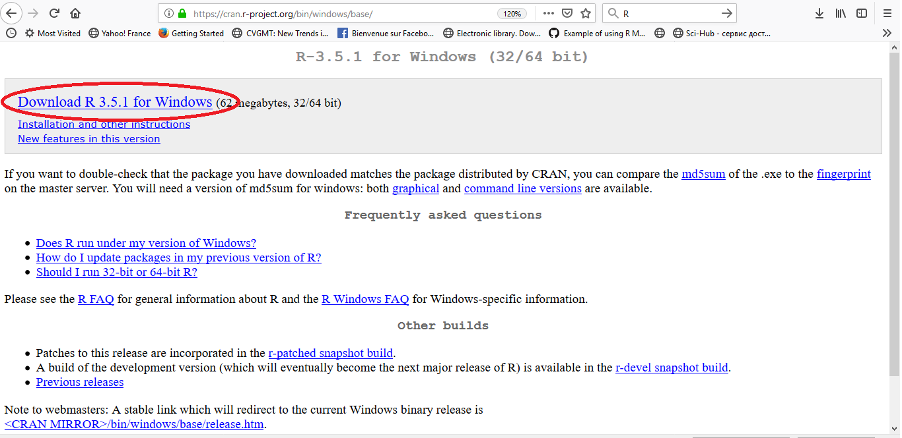
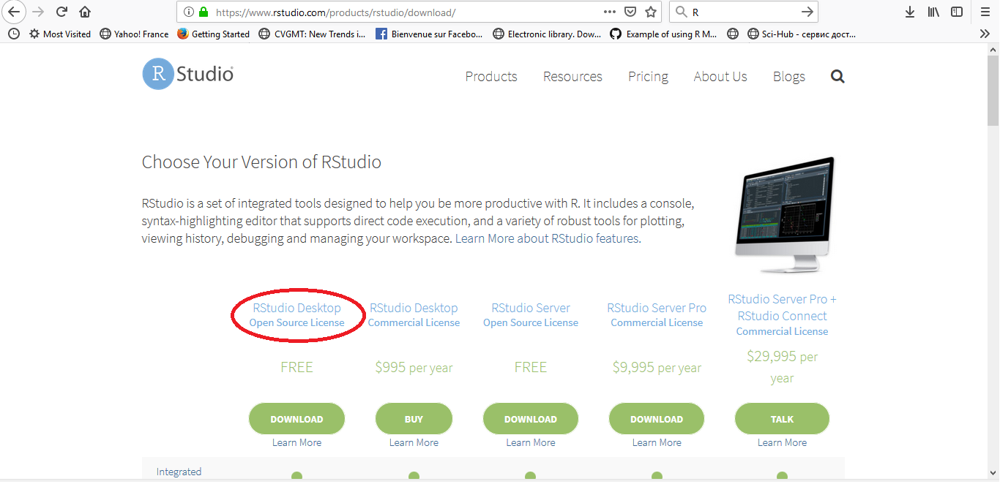
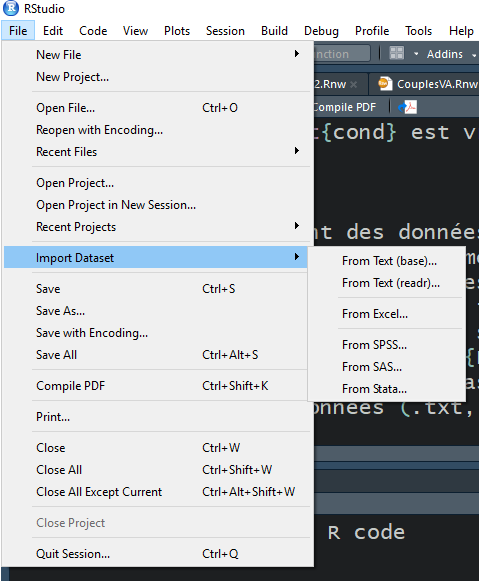

```{r setup, include=FALSE}
knitr::opts_chunk$set(comment=NA, message = F, warning = F, background ="cornsilk2" )
```

# Introduction

R est un logiciel de calcul scientifique interactif __libre__ et __gratuit__ qui possède une large collection d'outils statistiques et graphiques. Plusieurs sites sont consacrés à ce logiciel. Parmi lesquels, je cite:

- [http://http://www.r-project.org/](http://http://www.r-project.org/). Le site officiel du logiciel dans lequel on trouve une description exhaustive sur le langage R et fournit les liens indispensables pour les différents téléchargements.

- [http://www.statmethods.net/](http://www.statmethods.net/). QuickR, un site dans lequel on trouve les fonctions les plus utiles lors d'une analyse statistique uni et multi-variée.

- [https://www.learnbyexample.org/r/](https://www.learnbyexample.org/r/) Apprendre R par des exemples.

## Installation du logiciel R

Dans la page de r-project, on trouve des versions de R compilée et sont disponibles pour Windows, Linux et Mac OS X. Ici, on décrit l'installation de R sous Windows. Tout d'abord, on se rendre sur cette page: [http://cran.r-project.org/bin/windows/base/](http://cran.r-project.org/bin/windows/base/) et l'on suivra le premier lien pour télécharger le programme d'installation.
\pause

```{r, echo=FALSE, out.height="50%", out.width="80%", fig.align='center'}

```

\pause
Une fois le programme d'installation lancé, il suffira d'installer R avec les options par défaut.

## Installation de RStudio

Une fois R est correctement installé, je vous recommande fortement d'installer RStudio qui est téléchargeable depuis [http://www.rstudio.com/products/rstudio/download/](http://www.rstudio.com/products/rstudio/download/): 

\pause

```{r, echo=FALSE, out.height="70%", out.width="80%", fig.align='center'}

```

## Mise à jour de R

Pour mettre à jour R sous Windows, il suffit de télécharger et installer la dernière version du programme d'installation.

Il est à remarquer que la nouvelle version sera installée à côté de l'ancienne version. Afin de libérer de l'espace, vous pouvez désinstaller l'ancienne version en utilisant l'utilitaire __*désinstaller un programme*__ de Windows.

Lorsque plusieurs versions de R sont disponibles, RStudio choisit par défaut la plus récente.

# Démarrer avec R

## Le répartoire courant

Pour pouvoir récupérer des données, il est utile de connaître le répertoire de
travail, c'est-à-dire le répertoire sous lequel les divers résultats seront sauvegardés par défaut. Ce dernier s'obtient à l'aide la commande :

```{r,tidy=TRUE}
getwd() 
```
Tandis que la commande

```{r, eval=FALSE}
setwd("C:/User/Mes documents/CoursR")
```

change de répertoire courant. 

## Démarrer avec R

```{r, tidy=TRUE, tidy.opts=list(keep.blank.line=FALSE, width.cutoff=60)}
# ceci est un commentaire

# opérateurs: +, -, *, ^ (**), %/%, %%

# opérations matricielles: %*%, solve(), as.vector(), det(), t()
5%/%3
cos(pi/3)
## Saisie des données
XX<-c("M","M","D","C","C","M",rep("C",3),
      "M","C","M","V","M","V","D",rep("C",3),"M")
```

---

```{r, tidy=TRUE, tidy.opts=list(keep.blank.line=FALSE, width.cutoff=60)}
# Créer un objet x en lui affectant le nombre 2
x<-2
nom<-"Mohamed"
# Créer un objet x et afficher son contenu
(x<-2)

```

Le logiciel R travail avec des objets. Mais quelle est la classe de ces objets? de quels modes?

# Les différents objets

Les différents objets de R sont: vecteur, matrice, liste, tableau des données ou ts (time series).

- Vecteur: un vecteur peut être de mode numérique, caractère, complexe ou logique.
```{r}
x1<-c(1,-5)  # vecteur numérique
mode(x1)     # afficher le mode de l'objet x1.
x2<-c("Mohamed","Sarah")  # vecteur caractère
x3<-c(1i,1-1i,-2+3i) # vecteur complexe
x4<-c(TRUE,FALSE,T,F)  # vecteur logique
```

Pour créer des séries régulières, on peut utiliser les fonctions suivantes:
````{r}
# c(), seq(), : ou rep()
```

---

__La fonction c()__

Pour avoir l'aide de cette fonction, tapez ?c
```{r}
x1<-c(1,0,5,-4)  # création d'un vecteur
x1[3]            # extraction du troisième élément de x1
x1[-1]           # afficher tous les éléments de x1 sauf le premier
x1[x1>2]         # extraire les éléments supèrieur à 2.
x1>2             # vecteur logique pour tester si x1>2 ou non.
x11<-c("a","A","b","B")
lettres15<-letters[c(1,5)] # création d'un vecteur contenant la 
# première et la cinquième lettres minuscules
lettres15
LETTRES15<-LETTERS[c(1,5)]  # idem mais majuscules
LETTRES15

```

---
__La fonction `seq()`__

la fonction ` seq() ` est utilisée pour créer des séquences.

```{r}
seq1<-seq(0,1,by=0.1)  # séquence de 0 à 1 par incrémentation 0.1.
seq1
length(seq1)   # afficher la longueur de seq1
seq2<-seq(0,1,len=5)   # séquence de 0 à 1 de longueur 5.
seq2
seq3<-seq(0,1,len=11)  # même résultat que seq1
seq3

```

## 

__Les fonctions : et rep()__

la fonction ` : ` est utilisée pour créer des séquences entière de a à b.

```{r}
seq<-1:5  # séquence entière de 1 à 5.
seq
seqi<-6:-4
seqi

```

La fonction `rep()` est utilisée lorsqu'on veut répéter un élément ou un vecteur n fois.

```{r}
rep(1,5)
rep(1:3,3)
rep(1:3,each=3)
rep(1:3,each=3,times=2)

```

## 

```{r}
rep(1:3,each=2,len=12)
rep(c(0,1,6),times=c(2,5,4))
rep("a",5)
```

\pause

- Les matrices

Le deuxième objet traité avec R est l'objet matrice (`matrix`). Pour créer un tel objet, on utilise la fonction `matrix()`

```{r}
matrix(seq(-2,2,len=6),nrow=2,ncol=3)
# la fonction matrix remplie la matrice à créer colonne par colonne.
# Pour faire le remplissage ligne par ligne, on ajoute l'argument byrow=T.
matrix(seq(-2,2,len=6),nrow=2,ncol=3,byrow=T)
```

##

```{r}
# création des matrices en utilisant cbind() et rbind().
age<-c(22,21,24)
poids<-c(64,56,70)
cbind(age,poids)
rbind(age,poids)
M<-cbind(age,poids)
N<-rbind(age,poids)
colnames(M)  # les noms des colonnes
rownames(N)  # les noms des lignes

```

##

__Quelques opérations sur les matrices__

```{r}
m1<-matrix(seq(-2,2,len=6),nrow=3,ncol=2)
m1
t(m1)  # la transposée de m1
t(m1)%*%m1 # multiplication matricielle de m1' par m1
det(t(m1)%*%m1) # le déterminant 
```

##

```{r}
solve(t(m1)%*%m1)  # l'inverse.
diag(t(m1)%*%m1)   # la diagonale
diag(c(1,-2,5))    # matrice diagonale
sum(diag((t(m1)%*%m1)))  # la trace d'une matrice

```

##

- Les listes

La liste est le mode de stockage le plus général et polyvalent du langage R. Il
s'agit d'un type de vecteur spécial dont les éléments peuvent être de n'importe
quel mode

```{r}
(list1 <- list(size = c(1, 5, 2), user = "Mohamed", new = TRUE))
list1[[1]]   # accéder au premier élément de list1
list1[["size"]] # idem ou encore, list1$size.
```

# Fonctions utiles

## Arrondissement

On donne ici, quelques fonctions utiles.
```{r}
# arrondissement à l'entier
xx=c(0.253,2.146,pi,2*pi/3,11.5)
round(xx)     # arrondi à l'entier
round(xx,2)   # arrondi à la seconde décimale
round(xx,-1)  # arrondi aux dizaines
ceiling(xx)   # plus petit entier supérieur
floor(xx)     # plus grand entier inférieur
trunc(xx)     # troncature des décimales

```

## La fonction apply() et dérivées: 

- La fonction `apply()` permet d'appliquer une fonction `FUN` (par exemple une moyenne, une somme) à chaque ligne (si `MARGIN=1`) ou à chaque colonne (si `MARGIN=2`) d'un tableau de données `x`.\pause

- La fonction `sapply(x, FUN)` permet d'appliquer la fonction `FUN` à tous les éléments de la liste (du vecteur) `x`.

- La fonction `outer(x,y, FUN)`: Retourner une matrice de la form $M_{ij}=FUN(x_i,y_j)$

```{r}
outer(X=c(1,-2,3),Y=c(3,2,-4,5),"+")
```

# Traitement des données

## Importation des données: 

Avec R, il existe des diverses alternatives pour importer une base de données. On donne ici la méthode la plus simple. Il suffit de cliquer sur le bouton `File` du menu de RStudio, puis sur `Import Dataset`, ensuite choisir l'extension des données (.txt, .spss, etc).

```{r, echo=FALSE, fig.align='center', out.width="75%", out.height="70%"}

```

## Saisir des données au clavier: 

En utilisant la fonction `scan()`, la saisie d'une série de données peut paraître moins
fastidieuse.

```{r, eval=FALSE}
jeu1=scan()
1: -2
2: 1
3: 5
4: 
jeu1
```

Le premier retour après une chaîne vide met fin à la saisie

## Exporter une base de données: 
Pour exporter un tableau de données, on fait appel à la fonction `write.csv(x, file="",...)` où `x` est l'objet à exporter et `file` est une chaîne de caractère précisant l'emplacement où on veut enregistrer  l'objet `x`. 
```{r, eval=FALSE}
xx=matrix(seq(0,5,len=200),nc=4)
write.csv(xx, "D:/Cours_R/tab.csv")
# enregistrer l'objet xx dans le répertoire D:/Cours_R 
# sous le nom tab avec l'extension .csv
```

